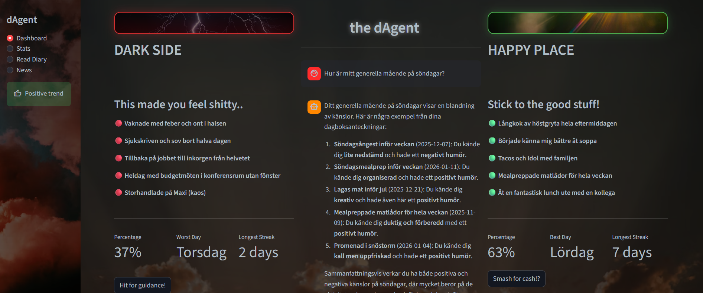

# 🎙️ dAgent (Personal Agent)

**Det ska vara enkelt att må bra – våga prova!**

dAgent är din intelligenta, röststyrda följeslagare. Prata med din dagbok och få personlig guidning och rådgivning, helt utifrån dina egna förutsättningar.

Här får du svart på vitt se vad som påverkar just ditt välmående – både positivt och negativt. Få insikter om vad du borde lägga din tid på och identifiera ditt vardags energibovar. Och, bara för att ha det lilla extra: analysera hur både du OCH omvärlden påverkas av det dagliga nyhetsflödet, kanske, eller kanske inte finns där en visst samband?

---

### Testa här: 
https://pa-frontend-cffkhcaueqhgc8cw.swedencentral-01.azurewebsites.net/

---

## Huvudfunktioner

* **Röststyrd Dagbok & Måendeanalys:** Prata in dina tankar. Ställ frågor om ditt liv. Agenten transkriberar (STT), sparar och analyserar sentiment. Visualisera hur ditt mående korrelerar med aktiviteter.
* **RAG-baserad Kunskapsbank:** Långtidsminne via vektordatabas. Dina frågor ställs mot forskningsrapporter och ger dig råd därefter (t.ex. *World Health Report* och *Perma model*) för faktagrundade svar.
* **Nyhetsagent:** Skrapar nyheter, sammanfattar och läser upp dem (TTS). Presenterar KPI:er för nyhetsflödet.
* **Typ-säker AI:** Använder Pydantic för att tvinga fram strukturerad output (JSON), vilket möjliggör programmerbar logik ovanpå AI-svaren.

## Tech Stack & Arkitektur

| Komponent | Teknologi | Syfte |
| --- | --- | --- |
| **Språk** | Python 3.11+ | Kärnlogik |
| **Orchestration** | Python + MCP | Hanterar flödet mellan verktyg och modeller |
| **Validering** | **Pydantic** | Tvingar strukturerad output (JSON) från LLM |
| **LLM (Cloud)** | **OpenAI** | Komplex analys, kodning, multimodal input |
| **Databas / RAG** | **LanceDB** | Vektordatabas för dokument och minne |
| **Audio Input** | `faster-whisper` | Använder WhisperModel för lokal Speech-to-Text (STT) |
| **Audio Output** | `edge-tts` | Text-to-Speech (TTS) |
| **Scraping** | FireCrawl | Informationshämtning från webbsidor |
| **Docker** | Containarize | Easy peasy för alla |
| **FastAPI** | Api-lager | Mellanlager mellan backend och frontend |
| **Streamlit** | Frontend | Dashboard |

## Kom igång GUIDE

1. Klona repot
2. Skapa en `.env`-fil i roten. Kolla .env-example 
3. Kör uv sync för att hämta dependencies
4. Terminal 1: uv run uvicorn api:app --reload
5. Terminal 2: uv run streamlit run app.py
6. För testdata: kör setup_db.py först.
---

## Sprints (Kanban)

### Sprint 1 - MVP (tillsammans)
- [x] Sätt upp API-server
- [x] Sätt upp LanceDB-databas
- [x] Skapa tables och ingesta data
- [x] Sätt upp pydantic-modeller
- [x] Skapa RAG-agent (Diary)
- [x] Koppla ihop samtliga till en enkel Streamlit
- [x] Personlig dagbok (Berätta hur dagen har varit) STT, sparas i .csv, just nu sparas WAV - hur göra?
- [x] Personlig dagbok (ställ frågor till den) STT
- [x] Skapa Docker volumes/container så att det funkar för alla
- [x] Få till Speech-to-text (transkribering)
- [x] Få till Text-to-speech

### Sprint 2 - TOOLS/MCP
- [x] Ingesta V-db med WorldHealthReport25 och hämta ut grejer
- [x] Scrapa nyhetssite och - sammanfatta - läs upp
- [x] Visa KPI:er för nyheter
- [x] Plotta korrelationen mellan mående och dag/aktivitet
- [x] Plotta fördelningen mellan nyhetskategorier

### Features for future
- Koppla dagbok till spotify för att se vilken musik du lyssnar på negativa dagar, samma med filmer
- Koppla sömn-data till dagboken för att se korrelation
- Koppla skärmtid (scrollande osv) till upplevt känsla dagen eller dagen efter
- Läs upp mail, schema för dagen/veckan
- Koppla nyhetesläget till börsen
- Sammanfatta youtube-klipp till .md-fil och/eller .mp3-fil

### För Google Calender
1. Skapa ett projekt i Google Cloud Console. Aktivera Google Calendar API.
2. Gå till Credentials, skapa en OAuth 2.0 Client ID och ladda ner JSON-filen. Döp om den till credentials.json. Lägg till testuser för den mail du vill använda
3. I projektrooten - kör uv add --upgrade google-api-python-client google-auth-httplib2 google-auth-oauthlib
4. 
5. 